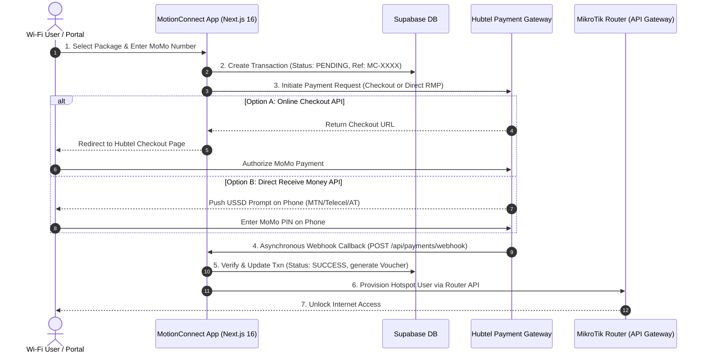

# MotionConnect — Hubtel Payment Integration Technical Specification & Documentation

**Prepared for:** MotionConnect & Hubtel Engineering Review Meeting  
**Date:** July 30, 2026  
**System Version:** MotionConnect v2.4  
**Author:** Engineering Lead / Orchestration Architecture  

---

## 1. Executive Summary

MotionConnect is a high-performance Captive Portal and ISP Management Gateway for MikroTik Wi-Fi networks in Ghana. It enables guest Wi-Fi users to select internet data packages, pay seamlessly via Mobile Money (MTN, Telecel, AT), and immediately receive network access.

This document details the payment architecture, implementation options, payload specifications, database transactions, and automated MikroTik provisioning triggers. It is structured for technical review with Hubtel's integration engineering team.

---

## 2. System Architecture & High-Level Sequence



---

## 3. Implementation Options & Code Specification

MotionConnect supports two Hubtel API integration modes:

### Option A: Hubtel Online Checkout API (Hosted Web Page)
* **Endpoint:** `POST https://payproxyapi.hubtel.com/items/initiate`
* **Authentication:** HTTP Basic Authentication (`Authorization: Basic base64(Client_ID:Client_Secret)`)
* **Use Case:** Redirects the user to a secure Hubtel-hosted web portal to select payment method and complete checkout.

#### Request Code Implementation (`services/payment.service.ts`):
```typescript
const auth = Buffer.from(`${clientId}:${clientSecret}`).toString('base64');
const url = 'https://payproxyapi.hubtel.com/items/initiate';

const payload = {
  totalAmount: amount,
  description: `Motion Connect Wi-Fi: ${pkg.name}`,
  callbackUrl: 'https://your-domain.com/api/payments/webhook',
  returnUrl: 'https://your-domain.com/portal/status?ref=' + reference,
  merchantAccountNumber: merchantAccount,
  clientReference: reference,
};

const response = await fetch(url, {
  method: 'POST',
  headers: {
    'Content-Type': 'application/json',
    'Authorization': `Basic ${auth}`,
    'Cache-Control': 'no-cache',
  },
  body: JSON.stringify(payload),
});
```

---

### Option B: Hubtel Direct Receive Money API (Direct USSD Push)
* **Endpoint:** `POST https://rmp.hubtel.com/merchantaccount/merchants/{merchantAccountId}/receive/mobilemoney`
* **Authentication:** HTTP Basic Authentication (`Authorization: Basic base64(Client_ID:Client_Secret)`)
* **Use Case:** Directly triggers a USSD Mobile Money PIN prompt on the customer's phone without leaving the captive portal.

#### Network Auto-Detection Logic (`components/portal/CaptivePortal.tsx`):
* `024`, `025`, `053`, `054`, `055`, `059`, `033` $\rightarrow$ `mtn-gh`
* `020`, `050` $\rightarrow$ `vodafone-gh` (Telecel)
* `027`, `057`, `026`, `056` $\rightarrow$ `tigo-gh` (AT)

#### Request Payload Structure (`services/payment.service.ts`):
```typescript
const url = `https://rmp.hubtel.com/merchantaccount/merchants/${merchantAccount}/receive/mobilemoney`;

const payload = {
  CustomerName: request.name || 'Motion Connect User',
  CustomerMsisdn: request.phone, // e.g. 0553306360
  Channel: request.network,       // 'mtn-gh' | 'vodafone-gh' | 'tigo-gh'
  Amount: amount,                 // e.g. 10.00
  PrimaryCallbackUrl: callbackUrl,
  Description: description,
  ClientReference: reference,
};
```

---

## 4. Webhook Receiver & MikroTik Auto-Provisioning

* **Endpoint:** `POST /api/payments/webhook`
* **Security:** Validates `x-hubtel-signature` HMAC SHA-256 header.

#### Processing & Provisioning Flow (`app/api/payments/webhook/route.ts`):

```typescript
export async function POST(request: Request) {
  const rawBody = await request.text();
  const payload = JSON.parse(rawBody);
  const reference = payload.ClientReference || payload.clientReference;
  const isSuccess = payload.ResponseCode === '0000' || payload.Status?.toLowerCase() === 'success';

  if (isSuccess) {
    // 1. Fetch transaction details from Supabase
    const transaction = await TransactionService.getByReference(reference);

    // 2. Generate unique Wi-Fi voucher credentials
    const voucher = `MC-${Math.random().toString(36).substring(2, 8).toUpperCase()}`;

    // 3. Provision Hotspot User on MikroTik Router API
    await RouterService.createHotspotUser({
      name: voucher.toLowerCase(),
      password: voucher.toLowerCase(),
      profile: transaction.package_profile || 'weekly',
      comment: `Txn Ref: ${reference} | Hubtel Webhook`,
    });

    // 4. Update Database Status to SUCCESS
    await TransactionService.updateTransaction(reference, {
      status: 'success',
      hubtel_reference: payload.TransactionId,
      voucher_code: voucher,
      mikrotik_synced: true,
      expires_at: new Date(Date.now() + durationSec * 1000).toISOString(),
    });
  }
}
```

---

## 5. Technical Review & Discussion Points for Hubtel Meeting

During the technical meeting with Hubtel, the following specific implementation items should be clarified and verified:

1. **Authentication Header Format (`payproxyapi` vs `rmp`):**
   * Confirm if `payproxyapi.hubtel.com/items/initiate` requires `Client ID:Client Secret` or `API Key:API Secret` for Basic Auth.
   * Clarify why standard Basic Auth headers return `401 Unauthorized` with `Content-Length: 0` on specific Merchant IDs in sandbox/live.

2. **IP Whitelisting Requirements (`rmp.hubtel.com`):**
   * Confirm public IP whitelisting procedure for developer local testing environments (`403 Forbidden` resolution) and cloud production servers (Vercel / AWS static IPs).

3. **Webhook Callback Verification (`x-hubtel-signature`):**
   * Confirm the exact HMAC SHA-256 string construction expected for signature validation on incoming callbacks.

4. **Network Channel Codes:**
   * Confirm active channel strings for Ghana Mobile Money networks (`mtn-gh`, `vodafone-gh`, `tigo-gh`).

---

*Document automatically generated by MotionConnect Engineering Architecture.*
